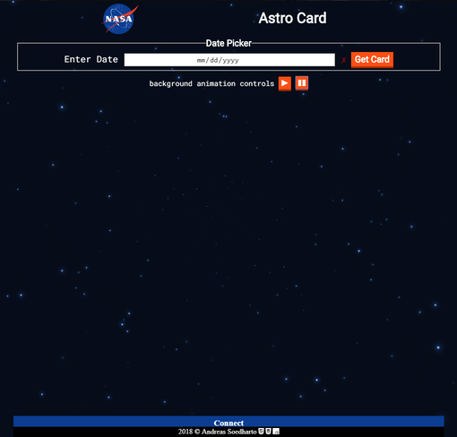
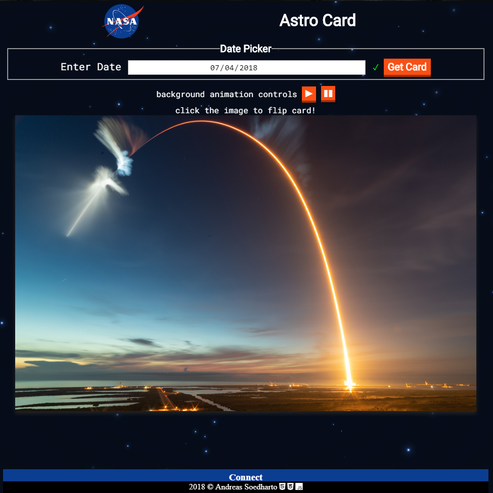
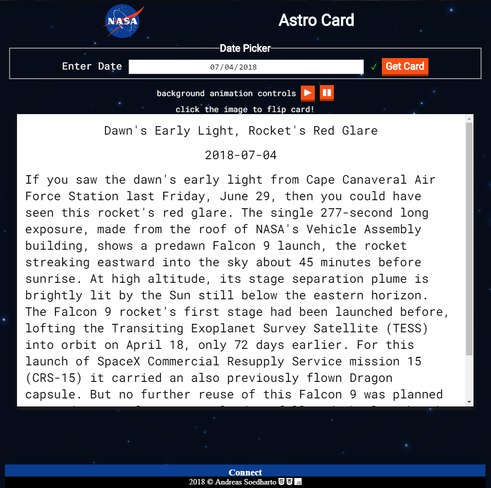

# ASTRO CARD APP
The Link to my [Astro Card](https://peterandreas77.github.io/astro-card/).

## Summary

### Screenshot
  
  
This App is intended to be used as a learning tool for those who are young at heart and have a passion for astronomy.

- First, it will ask for the user's input in the form of a date format mm/dd/yyyy.
- The input date will have a min and max dates already setup from the get go; because it will pull data from the NASA picture of the day API, the min date is the first date this service starts, and the max date is today.
- It will then provide immediate feedback to the user if their input is valid, within min and max range, and in mm/dd/yyy format.
- Once the user sees that their input is valid, they can click the "get card" button. It will then render the image or video of the day in the form of a card.
- When the user clicks the card, it will flip and reveal related details of what is going on inside the picture or video.
  
  ### Front of the Card
  
  
  ### Back of the Card
  

## Technology used
```
HTML5
CSS3
JavaScript
JQuery
```
